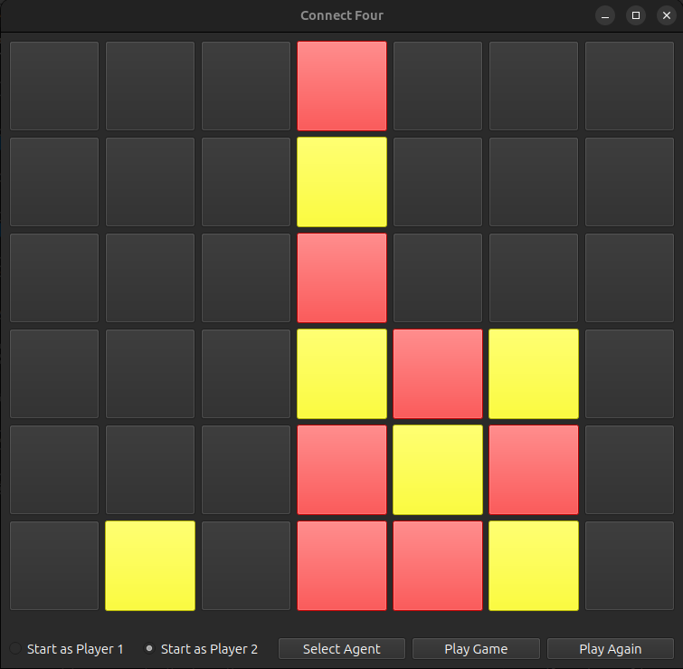

# Connect Four AI with Deep Reinforcement Learning

This project presents a Connect Four game with a graphical user interface (GUI), where the opponent is an AI trained using various Deep Reinforcement Learning models, including DQN, DDQND, PPO, A3C, Hybrid and C51. The AI refines its gameplay by self-training and retains its learned strategy for competition against human players.



This project presents a Connect Four game with a graphical user interface (GUI), where the opponent is an AI trained using various Deep Reinforcement Learning models, including DQN, DDQND, PPO, and A3C. The AI refines its gameplay by self-training and retains its learned strategy for competition against human players.


## Scripts Overview

### `gui.py` Connect Four Game GUI Summary

This script employs PyQt6 to create a straightforward GUI for the Connect Four game. Key features include:

- **ConnectFour Class (QMainWindow):**
  - Creates the main window for the game, initializing UI elements like the game board grid, buttons, and status label.
- **UI Initialization:**
  - Organizes the game board and buttons using QGridLayout.
  - Represents the game board with buttons using a 2D array (`board`).
  - Configures click events for buttons to trigger the `on_click` method.
- **Button Click Handling (`on_click` method):**
  - Updates the game board upon button click.
  - Checks for win or draw conditions after each move.
  - Alternates between players after each valid move.
- **Win Condition Check (`check_win` method):**
  - Examines win conditions in all directions (horizontal, vertical, and diagonal).
- **Counting Consecutive Pieces (`count_aligned` method):**
  - Determines a win by counting consecutive pieces in a specific direction.
- **Counting in a Single Direction (`count_direction` method):**
  - Counts pieces in a single direction to check for win conditions.
- **Draw Condition Check (`check_draw` method):**
  - Verifies draw conditions when the top row of each column is filled.
- **Example Usage:**
  - Initializes the PyQt application, creates the ConnectFour window, and starts the application loop.

This script provides a graphical interface for playing Connect Four, featuring player turns, win detection, and draw conditions.

### `main.py` Summary

This script, serving as the Connect Four game's entry point, utilizes PyQt6 for window creation and game management. Key features include:

- **Window and Board Setup:**
  - Creates a 600x600 window with a 6x7 grid layout for the game board.
- **Move Handling:**
  - Manages player and AI moves, updating the game state and UI accordingly.
- **Model Loading:**
  - Allows users to choose from various agents (DQN, DDQND, Hybrid, PPO, A3C) via a dialog.
  - Loads pre-trained agents based on the selected type and player for seamless integration.
- **Game Dynamics:**
  - Dynamically updates the game state and UI after each move, visually representing player and AI actions.
- **Termination Conditions:**
  - Checks for win, loss, or draw conditions, providing relevant messages upon game conclusion.
- **Player Control:**
  - Enables users to start as Player 1 or Player 2, offering intuitive game control buttons.
- **Agent Interaction:**
  - Facilitates the selection of an agent to play against, enhancing user experience.
- **Exception Handling:**
  - Implements robust error handling, displaying meaningful messages in case of agent loading issues.
- **Entry Point:**
  - Initiates the PyQt6 application, seamlessly combining game logic, UI, and agent integration for a cohesive Connect Four gaming experience.

### `environment.py` Summary

The `ConnectFourEnv` class defines a custom environment for the Connect Four game, adhering to the gym interface. Key functionalities include:

- **Initialization:**
  - Creates a 6x7 Connect Four board, initializes the current player, and sets maximum moves to 42.
- **Reset:**
  - Resets the board, randomly selects the starting player, and returns the initial observation.
- **Step:**
  - Places a player's piece in the selected column, checks for a win or draw, and assigns rewards accordingly.
- **Rendering:**
  - Displays the current state of the board to the console.
- **Game State Check:**
  - Determines if the game is in a terminal state (win, draw, or ongoing).
- **Winning Check:**
  - Checks for a win condition in all directions from the last move.
- **Result Determination:**
  - Determines the result of the game (win, loss, draw) if it's in a terminal state.
- **Valid Actions:**
  - Retrieves a list of valid columns where a piece can be placed.
- **Last Move:**
  - Retrieves the row and column of the last move.
- **Clone:**
  - Creates a clone of the environment.

This class encapsulates the game's logic, providing methods for interacting with the environment, checking game status, and making moves.

### `dqn.py` DQN Agent Training Script Summary

This script defines a Deep Q-Network (DQN) agent for training in a Connect Four environment. Key components include:

- **DQN Model:**
  - A PyTorch neural network (`DQN`) representing the Q-function, with one-hot encoding for board states.
- **Experience Replay Buffer:**
  - `ExperienceReplayBuffer` class managing a buffer of experiences for training stability.
- **DQNAgent Class:**
  - Agent using DQN to learn optimal actions in the Connect Four environment.
  - Implements epsilon-greedy exploration for action selection.
  - Utilizes experience replay and target network to improve training stability.
  - Performs a training step using the Mean Squared Error loss.
- **Agent vs Agent Training:**
  - `agent_vs_agent_train` function for training two DQN agents against each other.
  - Training loop with epsilon decay and batch processing of experiences.
  - Outputs episode statistics and winner information.
- **Example Usage:**
  - Creates a Connect Four environment and two DQN agents.
  - Trains the agents in an adversarial setting.
  - Saves the trained agents' states for future use.

This script provides a comprehensive setup for training DQN agents to play Connect Four against each other, facilitating reinforcement learning in a competitive environment.

### `ddqn.py` Dueling DQN Agent Training Script Summary

This script extends the DQN-based Connect Four agent to use a Dueling DQN architecture. Key components include:

- **DuelingDQN Model:**
  - A PyTorch neural network (`DuelingDQN`) implementing the Dueling DQN architecture, separating value and advantage streams.
- **Experience Replay Buffer:**
  - Same as in the DQN script, an `ExperienceReplayBuffer` class manages a buffer of experiences.
- **DDQNDAgent Class:**
  - Similar to the DQN agent but using the DuelingDQN model for Q-value estimation.
  - Implements Double Q-learning by using the target model for action selection during training.
- **Agent vs Agent Training:**
  - `agent_vs_agent_train` function facilitates training Dueling DQN agents against each other.
  - Training loop, epsilon-greedy exploration, and batch processing of experiences are similar to the DQN agent.
- **Example Usage:**
  - Creates a Connect Four environment and two Dueling DQN agents.
  - Trains the agents in an adversarial setting.
  - Saves the trained agents' states for future use.

This script introduces the Dueling DQN architecture to improve Q-value estimation in a competitive Connect Four environment.

### `a3c.py` Asynchronous Advantage Actor-Critic (A3C) Agent Training Script Summary

This script implements the Asynchronous Advantage Actor-Critic (A3C) algorithm for training Connect Four agents. Key components include:

- **PolicyValueNet Model:**
  - A PyTorch neural network (`PolicyValueNet`) for estimating both policy and value.
- **`A3CAgent` Class:**
  - Implements the A3C agent with methods for training and action selection.
  - Uses an asynchronous training approach with multiple workers.
- **Training:**
  - `train` method trains the agent using the A3C algorithm, updating the policy and value networks asynchronously.
  - The script includes a `train_async` function for asynchronous training over multiple episodes.
- **Episode Run:**
  - `run_episode` method runs an episode, collecting states, actions, rewards, next states, dones, and values.
  - The `compute_returns` method calculates discounted returns for training.
- **Selecting Actions:**
  - `select_action` method selects actions during both training and testing.
- **Agent vs Agent Training:**
  - `agent_vs_agent_train` function facilitates training A3C agents against each other.
  - Training loop, action selection, and episode completion are handled.
- **Example Usage:**
  - Creates an A3C agent and trains it asynchronously.
  - Creates two A3C agents and trains them against each other.
  - Saves the trained models for future use.

This script applies the A3C algorithm for training Connect Four agents in an asynchronous manner, enhancing exploration and convergence.

### `ppo.py` Proximal Policy Optimization (PPO) Agent Training Script Summary

This script implements the Proximal Policy Optimization (PPO) algorithm for training Connect Four agents. Key components include:

- **PPO Model:**
  - A PyTorch neural network (`PPO`) for estimating policy and value.
- **PPOAgent Class:**
  - Implements the PPO agent with methods for action selection, training steps, and buffer management.
- **Training Step:**
  - The `train_step` method performs PPO training using multiple optimization epochs, calculating actor and critic losses, and applying gradient updates.
- **Buffer Management:**
  - The `add_to_buffer` method adds experiences to the buffer, and `reset_buffer` clears the buffer after each episode.
- **Selecting Actions:**
  - The `select_action` method selects actions during both training and testing, using multinomial sampling during training.
- **Episode Run and Training Loop:**
  - `agent_vs_agent_train_ppo` function facilitates training PPO agents against each other.
  - Training loop, action selection, and episode completion are handled.

### `c51.py` Categorical 51 (C51) Agent Training Script Summary

This script implements the Categorical 51 (C51) algorithm for training Connect Four agents. Key components include:

- **C51 Model:**
  - A PyTorch neural network (`C51`) for estimating a categorical distribution over action values.
- **C51Agent Class:**
  - Implements the C51 agent with methods for action selection, training steps, and buffer management.
  - Uses experience replay with a Categorical distributional approach.
- **Training Step:**
  - The `train_step` method performs a C51 training step, including sampling from the experience replay buffer, computing loss, and applying gradient updates.
  - Utilizes a target model for stability, updating it periodically.
- **Experience Replay and Buffer Management:**
  - The script includes an `ExperienceReplayBuffer` class for managing experiences and sampling batches for training.
- **Action Selection:**
  - The `select_action` method selects actions during both training and testing, employing epsilon-greedy exploration.
- **Episode Run and Training Loop:**
  - The `agent_vs_agent_train` function facilitates training C51 agents against each other.
  - The training loop, action selection, and episode completion are handled, with epsilon decay for exploration.
- **Save Trained Agents:**
  - The script saves the trained C51 agents' states, target model states, and optimizer states after training.

### `hybrid.py` Hybrid Dueling DQN Agent Training Script Summary

This script defines a hybrid Dueling DQN agent for training in a Connect Four environment. Key components include:

**DuelingDQN Model:**
- A PyTorch neural network (`DuelingDQN`) implementing the Dueling DQN architecture, combining both value and advantage streams.
- Utilizes one-hot encoding for board states.

**Experience Replay Buffer:**
- `ExperienceReplayBuffer` class managing a buffer of experiences for training stability.

**HybridAgent Class:**
- Agent using the hybrid Dueling DQN to learn optimal actions in the Connect Four environment.
- Implements Double Q-learning by using the target model for action selection during training.
- Introduces a penalty term for instant loss moves and adapts the loss calculation accordingly.
- Performs a training step using the Mean Squared Error loss.
- Includes a mechanism for updating the target model periodically.

**Instant Loss Move Penalty:**
- The agent identifies and penalizes instant loss moves during training, introducing a penalty term in the loss calculation.

**Agent vs Agent Training:**
- `agent_vs_agent_train` function facilitates training Hybrid Dueling DQN agents against each other.
- Training loop, action selection, and episode completion are handled.

**Example Usage:**
- Creates a Connect Four environment and two Hybrid Dueling DQN agents.
- Trains the agents in an adversarial setting.
- Saves the trained agents' states for future use.

This script introduces a hybrid Dueling DQN architecture to enhance Q-value estimation and introduces a penalty mechanism to discourage instant loss moves during training. The training process is facilitated in an adversarial setting, and the trained agents' states are saved for future use.


### Connect Four AI Testing Script Summary

In each model provided a script which tests the performance of Connect Four AI agents in various scenarios:

- **RandomBot Class:**
  - Represents a simple bot that selects random valid actions in the Connect Four environment.
- **Simulate Game Function (`simulate_game`):**
  - Simulates a single game between two AI agents and returns the winner.
- **AI vs. Random Bot Testing Function (`test_ai_vs_random`):**
  - Tests an AI agent against a random bot over a specified number of games.
  - Tracks wins for the AI and the random bot, as well as draws.
- **Random Bot vs. AI Testing Function (`test_random_bot_vs_ai`):**
  - Tests a random bot against an AI agent over a specified number of games.
  - Tracks wins for the random bot and the AI, as well as draws.
- **AI vs. AI Testing Function (`test_ai_vs_ai`):**
  - Tests two AI agents against each other over a specified number of games.
  - Tracks wins for both AI agents and draws.
- **Example Usage:**
  - Initializes a Connect Four environment and loads pre-trained AI agents (DQNAgent and etc).
  - Performs testing scenarios for AI vs. Random Bot, Random Bot vs. AI, and AI vs. AI.
  - Prints the results of each testing scenario.

- **Performance Summary:**
  - All baseline bots demonstrate an approximate 85% win rate against the `random_bot`.
  - The Hybrid Dueling DQN agent stands out with an outstanding 97% win rate against the `random_bot`, showcasing exceptional performance.


## Installation

Ensure you have Python 3.6 or higher and pip installed on your system. To install the required libraries for the Connect Four AI, execute the following command in your terminal:

```
pip install -r reqirement.txt
```
This command will install PyQt6 for the GUI, PyTorch for deep learning algorithms, Gym for the game environment, NumPy for numerical computations, and tqdm for progress bars during training and testing.

## Usage

First, set the python path in the terminal by running:

```
export PYTHONPATH=$PWD
```

### Training the AI

To train the AI model, run one of the following scripts depending on the version of DQN you want to use:

For the standard DQN as an example:

```
python dqn.py
```

### Playing Game with AI

After training, you can start a game against the AI by executing:
```
python main.py
```
Also trained models are saved in saved_model directory.

### Testing the AI

To evaluate the AI's performance against a random bot, example of use:
```
python test_dqn.py
```
This script will simulate games and provide statistics on the AI's performance.
